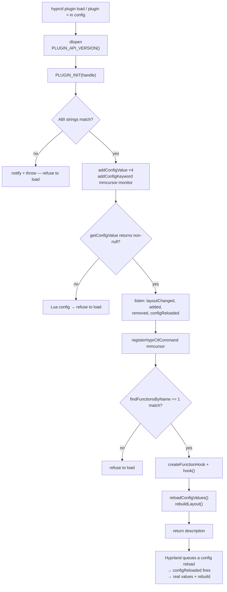
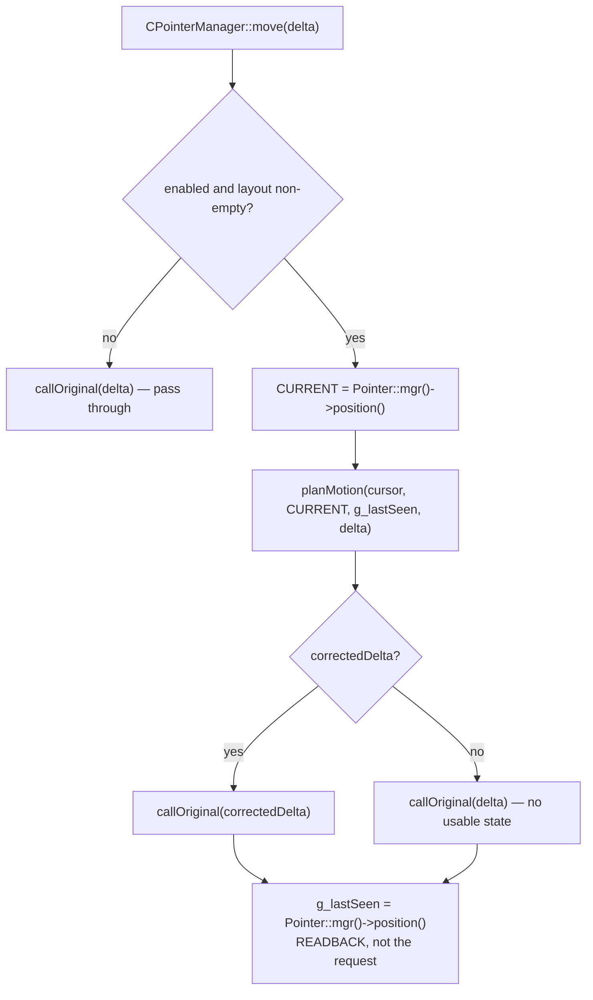
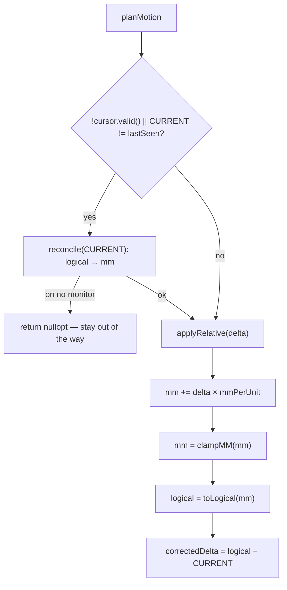

# A guided read of mmcursor

A walkthrough of this plugin from the outside in: the idea, how Hyprland loads
plugins at all, what we hook and why, the three control flows, and then every
file in detail.

This is the *tour*. [README.md](README.md) is the design argument and
[ROADMAP.md](ROADMAP.md) is the list of hard-won compositor facts; both are
worth reading after this, and neither is repeated here in full.

Every heading links into the code. Read with the file open next to it.

---

## Contents

1. [The idea in one diagram](#1-the-idea-in-one-diagram)
2. [How Hyprland accepts a plugin](#2-how-hyprland-accepts-a-plugin)
3. [What this plugin hooks into](#3-what-this-plugin-hooks-into)
4. [Control flow: the three paths](#4-control-flow-the-three-paths)
5. [The pure core, file by file](#5-the-pure-core-file-by-file)
6. [The glue, file by file](#6-the-glue-plugincpp-in-detail)
7. [How it is tested](#7-how-it-is-tested)
8. [Where it breaks next](#8-where-it-breaks-next)

---

## 1. The idea in one diagram

Hyprland places monitors at rigid offsets in **logical pixels**. Two panels with
different pixel densities therefore agree with physical reality at exactly one
point — wherever you aligned them — and diverge everywhere else. On the desk
this was written for, that divergence reaches **28.75 mm** at the top edge:

| | resolution | physical | density |
|---|---|---|---|
| Main | 2560×1440 | 600×340 mm | 4.235 px/mm |
| Secondary (rotated) | 1080×1920 | 300×530 mm | 3.623 px/mm |

The fix is a change of canonical coordinate system. **Millimetres are ground
truth; logical pixels are a projection.**

```
        relative input delta (accelerated, from libinput)
                          │
                          │  × mmPerUnit
                          ▼
              mm accumulator  ← the ONLY state we keep
                          │
                          │  clamp to the union of the panels' physical rects
                          ▼
        per-monitor affine map  →  logical pixels
                          │
                          ▼
                     compositor
```

Per monitor, the projection is one affine map between two known rectangles:

```
logical = M.logical_origin + (p_mm − M.mm_origin) × (M.logical_size / M.mm_size)
```

There is no seam correction term anywhere in this repo, because there is no seam
case to correct. Two panels that are adjacent on the desk are adjacent in mm
space, and a point crossing that boundary projects through a different affine map
on the other side. **The bug stops being expressible** rather than getting fixed.

That single decision generates the whole design:

- if mm is canonical, mm must be the only accumulator — round-tripping
  mm → logical → mm loses precision and the two spaces silently drift apart;
- if mm is canonical, the *accumulator* must be clamped, not just its projection,
  or the cursor parks visually at an edge while the internal position keeps
  travelling into dead space (that's hysteresis: walk right into a bezel, walk
  back, land somewhere else);
- if mm is canonical, anything that sets the cursor position *behind our back*
  invalidates our state, so we need a way to notice — see
  [reconcile](#planmotion--the-reconcile-decision).

---

## 2. How Hyprland accepts a plugin

A Hyprland plugin is a plain `.so` that the compositor `dlopen`s. There is no
sandbox and no IPC boundary: your code runs **inside the compositor process**,
on the same thread, with full access to its internals. A crash in your hook is a
crash of the session.

### The three exported symbols

Everything Hyprland requires of a plugin is at the bottom of
[src/plugin.cpp](src/plugin.cpp#L463-L592):

| symbol | when | ours |
|---|---|---|
| `PLUGIN_API_VERSION()` | at load, before anything else | [plugin.cpp:463](src/plugin.cpp#L463-L465) |
| `PLUGIN_INIT(HANDLE)` | once, to set everything up | [plugin.cpp:467](src/plugin.cpp#L467-L581) |
| `PLUGIN_EXIT()` | on unload | [plugin.cpp:583](src/plugin.cpp#L583-L592) |

`PLUGIN_INIT` receives a `HANDLE` that identifies you to every subsequent API
call, so it goes straight into a global:

```cpp
inline HANDLE PHANDLE = nullptr;   // src/plugin.cpp:38
```

and returns a `PLUGIN_DESCRIPTION_INFO` — name, description, author, version —
which is what `hyprctl plugin list` prints.

### Versioning is on you, not on Hyprland

`PLUGIN_API_VERSION` returns `HYPRLAND_API_VERSION`, a string that has read
`"0.1"` for years. It does **not** identify an ABI. Hyprland passes C++ objects
across the plugin boundary, so a plugin built against different headers, or by a
different compiler, does not fail to load — it corrupts memory somewhere later.

Two guards handle this, and both matter:

1. **The ABI-string check**, at
   [plugin.cpp:486-492](src/plugin.cpp#L486-L492). `__hyprland_api_get_hash()`
   resolves from the *running binary* at dlopen; `__hyprland_api_get_client_hash()`
   is inlined from the *headers we compiled against*. Both look like
   `36b2e0c..._aq_0.13_hu_0.14_hg_0.5_hc_0.1_hlg_0.6`, so this catches a bumped
   aquamarine or hyprutils as well as a bumped Hyprland. Comparing against
   `getHyprlandVersion().hash` instead — a bare commit hash — can never match,
   and that bug shipped once here.
2. **The compiler check**, in [`make check-toolchain`](Makefile). Hyprland
   records its compiler in the ELF `.comment` section; the Makefile reads it and
   refuses to build with a different GCC. A mismatch crashes at *load*, not at
   build, which is a bad place to learn about it.

### What the plugin API actually offers

`HyprlandAPI` (from `<hyprland/src/plugins/PluginAPI.hpp>`) is a small surface.
This plugin uses five parts of it, all wired up in `PLUGIN_INIT`:

| capability | call | ours |
|---|---|---|
| config values | `addConfigValue` / `getConfigValue` | [509-513](src/plugin.cpp#L509-L513), [345](src/plugin.cpp#L345-L381) |
| config keywords | `addConfigKeyword` | [513](src/plugin.cpp#L513) |
| events | `Event::bus()->m_events...listen()` | [532-538](src/plugin.cpp#L532-L538) |
| hyprctl commands | `registerHyprCtlCommand` | [540](src/plugin.cpp#L540) |
| function hooking | `findFunctionsByName` + `createFunctionHook` | [556-570](src/plugin.cpp#L556-L570) |

Four constraints on that list, each of which cost time to find:

- **Config registration is only legal inside `PLUGIN_INIT`.** Hyprland sets
  `m_allowConfigVars` exclusively around the `pluginInit` call, so these can
  never be deferred. See the comment at
  [plugin.cpp:494-506](src/plugin.cpp#L494-L506).
- **`registerCallbackDynamic` is a no-op in 0.56.0** — its body is commented
  out and it returns `nullptr`. The EventBus is the only working path
  ([plugin.cpp:528-531](src/plugin.cpp#L528-L531)).
- **EventBus listeners are `[[nodiscard]]` shared pointers whose lifetime *is*
  the subscription.** Drop the returned pointer and you silently stop receiving
  events. That is why they live in a struct of globals at
  [plugin.cpp:69-74](src/plugin.cpp#L69-L74) and are explicitly cleared in
  `PLUGIN_EXIT`.
- **`findFunctionsByName` shells out to `nm`.** It runs `nm -D -j` over the
  Hyprland binary and does a substring match, resolving the hit with `dlsym`.
  So binutils is a *runtime* dependency of loading any hooking plugin, and the
  string you pass is matched against the **mangled** symbol.

### Function hooking, concretely

`createFunctionHook(handle, address, ourFunction)` installs a trampoline. After
`hook()` succeeds, calls to that address land in your function instead, and
`m_original` holds a pointer to a thunk that runs the real one.

The compositor's method is a non-static member function, so the `this` pointer
is an explicit first argument in our C-style signature:

```cpp
using origPointerMove = void (*)(void*, const Vector2D&);   // src/plugin.cpp:234

void callOriginal(void* thisptr, const Vector2D& delta) {
    (*(origPointerMove)g_moveHook->m_original)(thisptr, delta);
}
```

This is x86_64-only and, by a wide margin, the most fragile thing in the repo.
Which is why it is four lines and why every claim justifying it is written down
next to it.

---

## 3. What this plugin hooks into

**Exactly one function.** The interposition point is a single arrow:
`delta → new global cursor position`.

```cpp
Pointer::CPointerManager::move(const Vector2D& deltaLogical)
// mangled: _ZN7Pointer15CPointerManager4moveERKN9Hyprutils4Math8Vector2DE
// PointerManager.cpp:831 in 0.56.0
```

The reasoning is in the long comment at
[plugin.cpp:178-232](src/plugin.cpp#L178-L232), and it is worth understanding
because "which site" is the whole design of a hooking plugin:

**It carries a pure logical delta and nothing else.** That is precisely the
arrow we are allowed to touch.

**It is downstream of relative-pointer dispatch.** In `onMouseMoved`, the
protocol send happens *first*:

```
InputManager.cpp:154   sendRelativeMotion(delta, unaccel)   ← clients get this
InputManager.cpp:155   Pointer::mgr()->move(DELTA)          ← we get called here
```

`zwp_relative_pointer_v1` carries deltas rather than deriving them from cursor
position, so a pointer-locked game has already been handed the untouched libinput
delta before our code runs. The "never mutate the delta" invariant therefore
holds **by construction**, not because anything here is careful. A game cannot
see our correction even in principle.

**It is upstream of all clamping.** `move()` computes a new position and calls
`warpTo()`, and `warpTo()` is what runs `closestValid()`. Hooking
`mouseMoveUnified` instead would hand us a position Hyprland had already computed
*and already clamped* — the wrong cross-seam decision already made, and a delta
to reverse-engineer in order to undo work just done.

**The delta is already accelerated.** libinput's profile has been applied, so
multiplying by our constant `mmPerUnit` preserves the shape of its curve.
`mmPerUnit` is a speed knob and nothing more.

### The sites we deliberately did not use

| candidate | why not |
|---|---|
| `Event::bus()->m_events.input.mouse.move` | It's `Cancellable<Vector2D>`, which looks perfect — but it emits `MOUSECOORDSFLOORED`, an *absolute, floored* position, from inside `mouseMoveUnified`. The verdict, not the delta. |
| `CInputManager::onMouseMoved` | Upstream of the relative-pointer send, so mutating there *would* reach locked clients. |
| `mouseMoveUnified` | Downstream of clamping (see above). |
| hooks on every absolute-motion path | The enumeration can't be proven complete. Replaced by the pull design in [§4](#c-external-move-the-pull). |

There is no event carrying relative motion, so the function hook is forced.

### And how the result is applied

We do **not** warp the cursor ourselves. We rewrite the delta to
`target − current` and call the original:

```cpp
callOriginal(thisptr, Vector2D{PLAN.correctedDelta->x, PLAN.correctedDelta->y});
```

The original then computes `oldPos + (target − oldPos) == target` and proceeds
normally, so we inherit its NaN guard, its input-capture handling, `warpTo`,
clamping, damage and focus for free. Note this parameter is *not* the event's
delta — that one is long gone by this point. It is Hyprland's internal "advance
the cursor by this much" instruction, and rewriting it is exactly equivalent to
setting a position.

---

## 4. Control flow: the three paths

### A. Load



Two things about the tail. `PLUGIN_INIT` runs **before** the config has been
parsed with our values in it — `PluginSystem` queues `Config::mgr()->reload()`
right after `pluginInit` returns. So the prime at
[plugin.cpp:577-578](src/plugin.cpp#L577-L578) reads whatever defaults exist just
so we aren't inert in the gap; the real values arrive moments later through the
`configReloaded` listener.

And every failure above is `notification + throw`. Hyprland catches an exception
during plugin init and survives — this plugin has tripped that twice. It does
*not* catch one thrown from the hook afterwards, which is why every check that
can be made at load time is made at load time.

### B. Motion — the fast path

This runs on every pointer event, so it is deliberately tiny:
[`hkPointerMove`](src/plugin.cpp#L240-L284) reads two observable values, calls a
pure function, and writes one back.



Inside [`planMotion`](src/apply.hpp#L68-L85):



Note what is *not* in the fast path: no logical → mm conversion unless an
external move actually happened. That lossy round-trip occurs only when the mm
state was already worthless.

### C. External move — the pull

Relative motion is not the only thing that moves a Wayland cursor.
`hyprctl dispatch movecursor`, tablets, touch, pointer-lock and confinement
handoff, client-side warps via the pointer-warp protocol, workspace and window
focus warps — all of them set an absolute logical position directly, bypassing
our hook entirely.

The tempting design is to hook each of those and *push* a `reconcile()` from
them, with a re-entrancy flag so we don't reconcile against our own warps. Don't:
that enumeration can never be proven complete, and it forces the mm → logical → mm
round-trip onto the fast path.

Instead we **pull**. `m_pointerPos` is written in exactly three places in 0.56.0
(`warpTo`, and two spots in `warpAbsolute`) and every one is observable through
`position()`. So:

> compare the cursor against the position **read back after our own last write**.
> If it differs, something else moved it.

One comparison, no flag to forget, and it covers paths added in future releases
without naming them.

Two consequences you will actually observe:

- **It must be a readback.** `warpTo()` runs positions through `closestValid()`,
  which perturbs points whose hotspot box straddles a seam. Storing the position
  we *requested* would report a phantom external move on every event near an edge
  and re-reconcile constantly. This is asserted by
  [tests/test_apply.cpp](tests/test_apply.cpp).
- **Reconcile is lazy** — it happens on the next relative event. So
  `hyprctl mmcursor` shows `(external move pending reconcile)` in between. That
  is the mechanism working, not a bug.

### D. Layout change

Any of `monitor.layoutChanged`, `monitor.added`, `monitor.removed`, or
`config.reloaded` re-runs [`rebuildLayout()`](src/plugin.cpp#L101-L176), which
throws away the mm state (`invalidate()`) and re-adopts the compositor's current
cursor. The layout moved under us, so whatever mm position we held is meaningless
and the compositor is authoritative.

---

## 5. The pure core, file by file

The rule the repo is built on:

> **Everything that can be logically wrong lives in files with zero Hyprland
> dependencies and a test around it.**

Four files qualify. They compile with a bare `g++` and no compositor anywhere in
sight, which is why `make test` runs in a second under ASan+UBSan.

### [geometry.hpp](src/geometry.hpp) / [geometry.cpp](src/geometry.cpp) — two spaces and the map between them

Two coordinate spaces, stated at the top of the header: **mm** (physical desk
space, ground truth, +x right +y down) and **logical** (Hyprland's global layout
space, post-scale, post-transform).

[`Rect`](src/geometry.hpp#L31-L50) is the interesting primitive, for one detail:

```cpp
bool contains(const Vec2& p) const {
    return p.x >= x && p.x < right() && p.y >= y && p.y < bottom();
}
```

Half-open on the far edges, so two edge-adjacent rects never both claim the
shared boundary — ownership goes to the right/lower rect, matching Hyprland's own
convention. The same half-openness is why
[`firstMMOverlap`](src/geometry.cpp#L98-L116) uses strict inequalities: adjacency
is the normal case, not an overlap.

[`MonitorMap`](src/geometry.hpp#L61-L71) is one panel's correspondence between
the desk and the layout — two rects describing the same physical object — plus
the affine map in both directions:

```cpp
Vec2 MonitorMap::toLogical(const Vec2& p_mm) const {
    return {logical.x + (p_mm.x - mm.x) * pxPerMMx(),
            logical.y + (p_mm.y - mm.y) * pxPerMMy()};
}
```

Scale is **derived, never configured**: `px_per_mm = logical.w / mm.w`, with x
and y handled independently because EDID sizes are rounded to whole centimetres
and rarely match the pixel aspect ratio exactly.

[`Layout`](src/geometry.hpp#L73-L117) is the collection, and
[`clampMM`](src/geometry.cpp#L48-L67) is the function that keeps the accumulator
honest: nearest point within the union of all mm rects, idempotent, so
re-clamping a clamped point is a no-op. (Caveat, documented in the header: the
union of differently-sized rects is not convex, so "nearest point" can behave
non-monotonically at the outer corners. Harmless — those are screen corners you
cannot move past anyway.)

[`Layout::toLogical`](src/geometry.cpp#L69-L90) has a fallback branch worth
noticing: a point that lands exactly on an outer boundary is excluded by
half-open containment, so it falls back to the nearest monitor's rect rather than
returning nothing.

### [layout_build.hpp](src/layout_build.hpp) / [.cpp](src/layout_build.cpp) — the active layout becomes a desk

This is the file that answers "where on the desk is each panel", and it is the
one place where a coordinate has to be invented rather than measured.

[`MonitorDesc`](src/layout_build.hpp) is the input: the logical rect Hyprland
gave us, the EDID physical size **in the panel's native orientation**, the output
transform, and the user's overrides.

[`physicalSizeMM`](src/layout_build.cpp#L9-L16) resolves that into the panel's
extent *on the desk*, which means applying the rotation:

```cpp
if (transformSwapsAxes(d.transform))
    return {nativeH, nativeW};
```

A quarter turn (`transform % 4 == 1 || == 3`) swaps which physical dimension runs
along which desk axis. This is why the config asks for native-orientation
millimetres and rotates them for you — it's the number printed on the box, and it
doesn't change when you rotate the monitor.

#### Why placement reads relations, not coordinates

The obvious way to derive a desk from Hyprland's layout is to convert each
monitor's logical origin to millimetres. It gives the wrong answer, and the desk
this was built for shows exactly why.

Secondary sits at logical `y = -240`. Divide by Main's 1440px/340mm and you get
56.7mm. The physically true offset is **95mm**. The conversion is wrong because
the offset spans *two* panels of different density, and dividing by one of them
assumes they match.

What the logical layout actually states is a **relation**: both centres are at
logical `y = 720`, i.e. "centred". Reproduce *that* physically and the answer is
exact. So [`chooseCross`](src/layout_build.cpp#L74-L112) computes three
candidates per seam — near edges flush, far edges flush, centres flush — takes
the smallest, reproduces it exactly in mm, and converts only the leftover
residual through the anchor's density:

```cpp
if (aCenter <= aNear && aCenter <= aFar)
    return {Rel::Center, dCenter};
```

An exactly-stated relation converts exactly; anything in between degrades
continuously. There is no tolerance to tune, and ties resolve centre → near → far
so the result never depends on declaration order.

#### The rest of the pass

[`buildLayout`](src/layout_build.cpp) grows a spanning tree:

1. absolute placements become roots; with none, the root is leftmost-then-topmost
   (which keeps the origin on the same panel the old row builder used, so
   pointer feel does not change);
2. explicitly stated relations are placed first — they are the user telling us
   something the layout cannot;
3. everything else attaches by its cheapest logical adjacency, flush seams before
   gapped ones, wider shared edges before narrower;
4. anything unreachable falls back to a converted logical origin **and warns**.

[`placeAgainst`](src/layout_build.cpp#L131-L180) does one child, and it is
written axis-agnostically on purpose — placing a monitor *above* another is the
same computation as placing one *beside* it with the axes swapped. Writing it
once is what stops the vertical case from becoming a second, subtly different
implementation of the horizontal one, which is precisely how the old row builder
came to handle only one of them.

`gapMM` defaults to `0.0`, which makes panels edge-adjacent in mm even though
real bezels exist. That is a deliberate lie: the honest alternative is a dead
zone where the cursor is "in the bezel" and visibly stalls. `SeamGap` overrides
it per pair. Collapsing at *build* time rather than special-casing gaps at
*projection* time is what keeps `clampMM` idempotent.

`BuildDiagnostics` records how each monitor got placed and anything the builder
had to guess at. That is what `hyprctl mmcursor` prints, and it is the difference
between diagnosing a wrong layout in one line and forming a theory by moving the
mouse around.

[`defaultMMPerUnit`](src/layout_build.cpp) is the inverse density of the **root**
monitor, so enabling the plugin is feel-neutral there and only changes behaviour
elsewhere. Monitors are emitted in placement order, root first, which is what
makes `monitors().front()` mean something.

### [cursor_state.hpp](src/cursor_state.hpp) / [.cpp](src/cursor_state.cpp) — the accumulator

The whole behavioural core, and intentionally tiny: a `Vec2 m_mm`, a
`double m_mmPerUnit`, a `bool m_valid`, and two entry points.

[`applyRelative`](src/cursor_state.cpp#L7-L39) — the fast path:

```cpp
const double dx = std::isfinite(delta.x) ? delta.x : 0.0;   // ← see below
...
Vec2 next{m_mm.x + dx * m_mmPerUnit, m_mm.y + dy * m_mmPerUnit};
m_mm = m_layout->clampMM(next);
return m_layout->toLogical(m_mm);
```

Three things are load-bearing here:

- **The NaN guard.** A driver quirk that hands over a non-finite delta poisons
  the accumulator *permanently*: NaN survives every subsequent addition, every
  comparison in `clampMM` returns false, and the cursor never recovers for the
  life of the session. The guard lives here rather than in the plugin because it
  is an invariant of the accumulator — and because this is the file with tests.
- **`clampMM` is applied to `m_mm`, not to the return value.** Clamping only the
  projection would let mm drift into dead space while the cursor sits parked at
  an edge; walking back would land somewhere else.
- **The signature.** `applyRelative` takes a `const Vec2&` and *returns a
  position*. That asymmetry is the "never mutate the delta" invariant expressed
  in a type, and it is exactly the kind of indirection a later refactor
  helpfully "simplifies" into a bug affecting every pointer-locked game at once.

[`reconcile`](src/cursor_state.cpp#L41-L54) — adopt an absolute logical position
that came from elsewhere. If the position maps to no monitor it marks itself
invalid rather than inventing a plausible-looking mm value.

### [apply.hpp](src/apply.hpp) — the decision, extracted so it can be tested

This file exists because of a specific mistake. The logic deciding *when to adopt
an external position* and *what corrected delta to return* is the most
error-prone code in the project, and while it lived in `plugin.cpp` nothing could
test it — which is precisely backwards from the repo's thesis.

So the arrow stays a single arrow, but the logic is stated as a pure function of
three observable values:

```
(current logical position, last-seen logical position, delta)
    → the delta to hand the compositor's own move()
```

#### `planMotion` — the reconcile decision

```cpp
inline MotionPlan planMotion(CursorState& cursor, const Vec2& currentLogical,
                             const Vec2& lastSeenLogical, const Vec2& delta) {
    MotionPlan plan;
    const bool moved = currentLogical.x != lastSeenLogical.x
                    || currentLogical.y != lastSeenLogical.y;

    if (!cursor.valid() || moved) {
        plan.adoptedExternal = true;
        if (!cursor.reconcile(currentLogical))
            return plan;              // on no known monitor: stay out of the way
    }

    const auto TARGET = cursor.applyRelative(delta);
    if (!TARGET)
        return plan;                  // no usable layout

    plan.correctedDelta = Vec2{TARGET->x - currentLogical.x, TARGET->y - currentLogical.y};
    return plan;
}
```

Eighteen lines, and [tests/test_apply.cpp](tests/test_apply.cpp) runs 15,628
checks against them by simulating whole sessions — including the compositor's own
clamping and third-party warps — with no compositor present.

`correctedDelta` being `nullopt` means "pass the original delta through
untouched": we have no usable state, and stock behaviour beats a guess.

**When you change the hook, change this file, not `plugin.cpp`.** Inlining "just
this one condition" back into the glue is how it became untestable the first
time.

---

## 6. The glue: plugin.cpp in detail

The only file with a `hyprland` include, and the only one expected to break on a
Hyprland update. Every touchpoint carries the source location that establishes
it, so the next person can re-verify in seconds instead of rediscovering.

### State — [lines 42-74](src/plugin.cpp#L42-L74)

`g_layout`, `g_cursor`, four config globals, the override map, the hook pointer,
and the listener struct. Plus the one that carries the design:

```cpp
// The logical position we last observed immediately after our own warp.
// This is the whole reconcile mechanism. It is a readback, not a prediction —
// never assign a value here that we merely *asked* for.
Vector2D g_lastSeen = {0, 0};
```

### [`rebuildLayout()`](src/plugin.cpp#L101-L176) — reading the compositor's monitors

Iterates `State::monitorState()->monitors()` (the *enabled* set — `allMonitors()`
is the superset including disabled outputs), skipping mirrors and anything with a
zero logical size (a monitor mid-configuration would divide by zero).

Field provenance is documented at [lines 80-100](src/plugin.cpp#L80-L100) and is
the part most likely to rot:

| field | meaning |
|---|---|
| `m_position` | logical origin |
| `m_size` | logical size, **already transformed and scaled** — `logicalBox()` is exactly `{m_position, m_size}`. Do not reconstruct it from mode × scale by hand, and do not use `m_pixelSize` or `m_transformedSize`. |
| `m_transform` | `wl_output_transform` |
| `m_output->physicalSize` | EDID mm, native orientation, `{0,0}` when unknown |

Then two hard refusals, both of which zero the layout and make the plugin inert
rather than half-applying a mapping:

1. **A panel with no physical size and no override** cannot participate
   ([132-139](src/plugin.cpp#L132-L139)). Headless outputs always land here.
2. **Overlapping mm rects** ([154-161](src/plugin.cpp#L154-L161)) mean two panels
   claim the same desk space, so which one a point belongs to comes down to
   declaration order and the cursor teleports for reasons nothing in the config
   explains. Not recoverable — refuse.

On success it installs the layout, sets `mmPerUnit`, **invalidates** the cursor
state, then reconciles against the compositor's current position and seeds
`g_lastSeen` from it.

### [`hkPointerMove`](src/plugin.cpp#L240-L284) — the hook body

Read [§3](#3-what-this-plugin-hooks-into) and [§4B](#b-motion--the-fast-path)
for the why. What is left in the function is:

```cpp
const Vector2D CURRENT = Pointer::mgr()->position();
const auto PLAN = pcs::planMotion(g_cursor, {CURRENT.x, CURRENT.y},
                                  {g_lastSeen.x, g_lastSeen.y},
                                  {deltaLogical.x, deltaLogical.y});
if (PLAN.correctedDelta) callOriginal(thisptr, {PLAN.correctedDelta->x, PLAN.correctedDelta->y});
else                     callOriginal(thisptr, deltaLogical);
g_lastSeen = Pointer::mgr()->position();
```

Two values in, one pure call, one readback out. Note there is deliberately **no**
NaN guard here — there is one in `applyRelative`, and two guards would mean only
one of them is tested.

### Config — [lines 286-420](src/plugin.cpp#L286-L420)

```
plugin {
    mmcursor {
        enabled     = true
        sensitivity = 1.0
        gap_mm      = 0.0
        align       = derive      # derive | top | center | bottom

        # name, physical width mm, physical height mm [, vertical offset mm]
        # width/height in NATIVE orientation; rotation is applied for you.
        mmcursor-monitor = Main,  600, 340
        mmcursor-monitor = Secondary, 530, 300

        # Placement is derived from the active layout; these override it.
        mmcursor-place  = Secondary, at, 620, -95
        mmcursor-place  = DP-11, below, Main, left, 12
        mmcursor-gap    = Main, Secondary, 22
        mmcursor-offset = Secondary, 0, -4
    }
}
```

`onMonitorKeyword` and its three siblings are hand-rolled comma splitters because
these must be **keywords**, not values — they repeat once per monitor or per
seam, and Hyprlang values don't repeat.

**Keyword state has to be cleared before every parse.** Hyprlang calls a handler
once per matching line and has no way to say "this line went away", so a handler
that accumulates into a map will keep a deleted `mmcursor-place` in force until
the compositor restarts. `clearConfigState()` runs from a
`config.preReload` listener for exactly that reason, and the ordering — that
`preReload` really does fire before the parse — is asserted in
`verify-placement.sh` by deleting a line and checking its effect is gone. It is
not documented anywhere; `ConfigManager.cpp` is not in the installed headers.

[`readConfig`](src/plugin.cpp#L345-L381) contains the single nastiest piece of
trivia in the repo, and it cost a compositor crash to find:

> **Hyprlang is asymmetric.** For a `STRING`, the slot holds the char pointer
> *itself* — one dereference. For `INT`/`FLOAT`, it holds a pointer to the number
> — two.

Using two dereferences on a STRING reads the first 8 bytes of the string's
*characters* as a pointer. It doesn't fail there; it fails later inside
`std::string`'s constructor, with a backtrace pointing nowhere near the cause.
Hyprland's own code puts both forms on adjacent lines in `HyprCtl.cpp:1687-1689`,
which is the clearest statement of the rule that exists anywhere.

[`reloadConfigValues`](src/plugin.cpp#L383-L420) also warns about a value that
isn't ours: `cursor:hotspot_padding` holds the cursor N logical px inside the
layout while our mm clamp stops at the true panel edge, wasting up to N px of
travel when walking back off an edge — the exact hysteresis this plugin removes
everywhere else.

### `debugDump` / `ctlCommand` — `hyprctl mmcursor`

Registered as a hyprctl *command* rather than a dispatcher, because a dispatcher
can only return success/error whereas this hands text back to the terminal. It
prints the mm position, the compositor's position, the last readback (with
`(external move pending reconcile)` when they differ), and the full per-monitor
mm ↔ logical table with derived densities — each row annotated with **how that
monitor got placed**:

```
Virtual-1  mm [   0.00    0.00  600.00x340.00]  …  <- root
Virtual-2  mm [ 600.00  -95.00  300.00x530.00]  …  <- right-of centre Virtual-1
```

This is the first thing to run when something feels wrong. Three subcommands sit
behind the same registration (which is why `exact` is `false` — a bare-name match
would not let arguments through):

```sh
hyprctl mmcursor version               # release + commit + the ABI it was built against
hyprctl mmcursor reload                # re-read config + rebuild
hyprctl mmcursor place  Secondary 620 -95  # try an origin, immediately
hyprctl mmcursor offset Secondary 0 -4     # nudge, immediately
```

`place` and `offset` are for tuning — positioning a monitor is a tape-measure
job — and deliberately do not persist, so `hyprland.conf` stays the one source of
truth.

There is no `--version` flag, and that is deliberate. `PLUGIN_DESCRIPTION_INFO`
is the plugin API's *own* version field and `hyprctl plugin list` already prints
it, so inventing a second convention would only create somewhere else to forget
to bump. That field and the `version` subcommand read one string, stamped by the
Makefile from `./VERSION` plus the commit — there is no version literal in the
source, because a second number is the thing that drifts. The dump repeats it on
its first line, so a pasted dump identifies itself without anyone having to ask
which build it came from.

### [`PLUGIN_EXIT`](src/plugin.cpp#L583-L592)

Hyprland tears down hooks, config values and hyprctl commands for us. The
listeners live in *our* globals, though, and would otherwise be destroyed after
our code is unmapped — so they are cleared explicitly.

---

## 7. How it is tested

```sh
make test        # 4 suites, compiler only, no Hyprland, ASan+UBSan
make plugin      # needs Hyprland headers; runs check-toolchain first
make vm-up       # fetch + boot + provision an Arch VM (needs qemu)
make vm-verify   # build inside it, load the plugin, run 88 assertions
hyprctl mmcursor # live debug dump
```

| suite | checks | what it can catch |
|---|---|---|
| [test_geometry.cpp](tests/test_geometry.cpp) | 81 | the pieces compute what they claim |
| [test_model.cpp](tests/test_model.cpp) | 60,569 | the headline properties, fuzz, and a *differential* comparison against a stock-Hyprland reference model — including the 28.75 mm assertion |
| [test_placement.cpp](tests/test_placement.cpp) | 402 | the desk derived from every arrangement, every override, and order-independence across all 24 permutations |
| [test_apply.cpp](tests/test_apply.cpp) | 15,628 | the hook's decision logic against a simulated, adversarial compositor |
| [test/vm/verify.sh](test/vm/verify.sh) | 20 | it actually works inside a running compositor |
| [test/vm/verify-placement.sh](test/vm/verify-placement.sh) | 68 | every layout and override again, but through `hyprland.conf` and a reload |

The suites were **mutation tested**: deliberately broken cores were checked to
confirm the tests can in fact fail.

Two things worth internalising about the harness:

- **Hyprland cannot run truly headless.** `CHeadlessBackend::drmFD()` returns −1
  and the allocator comes from a started backend's DRM fd, so headless-only dies
  with "no allocator available". It needs a real GPU seat or a parent
  compositor — hence the qemu VM, not a container. Do not plan CI around
  headless.
- **Never develop against the live session.** The plausible failure mode is
  "compositor alive, cursor unusable". Load manually with `hyprctl plugin load`
  while iterating; keep a keyboard-only escape route.

---

## 8. Where it breaks next

The honest list, in rough order of likelihood:

1. **A Hyprland update.** The mangled symbol
   `_ZN7Pointer15CPointerManager4moveERKN9Hyprutils4Math8Vector2DE` changes, or
   the ABI string does, or a `Monitor` field moves. The ABI guard turns all of
   these into "refuses to load" rather than "corrupts memory". Rebuild after
   every upgrade; the README suggests an Omarchy `post-update.d` hook.
2. **`plugin =` does not expand `~`** (unlike `source =`), and the resulting
   failure does *not* appear in `hyprctl configerrors`. Use absolute paths. The
   double-load guard compares path *strings*, so two spellings of the same file
   install two hooks.
3. **Still unexercised**, not known-broken: pointer-locked games, tablet/touch,
   and DPMS. Scale ≠ 1 and hotplug are covered in the VM but not on real
   hardware. [ROADMAP item 1](ROADMAP.md#1-finish-exercising-it-on-real-hardware).

And one known limit that is **out of scope by construction**: the cursor
*bitmap* straddling a seam looks disjoint until the hotspot crosses. A global
position is a single point, so the hotspot inherits the correction while the
image is drawn once per monitor from still-logical origins. Cosmetic; fixing it
means moving monitor *placement* into physical space, which is a compositor
feature, not a plugin.

---

## Recommended reading order

1. This file.
2. [src/geometry.hpp](src/geometry.hpp) — the two spaces, top comment first.
3. [src/cursor_state.hpp](src/cursor_state.hpp) — the invariants, stated as prose.
4. [src/apply.hpp](src/apply.hpp) — 18 lines that are the whole decision.
5. [src/plugin.cpp:178-232](src/plugin.cpp#L178-L232) — why this hook site.
6. [README.md](README.md) — the design argument in full.
7. [ROADMAP.md](ROADMAP.md#reference--facts-worth-not-rediscovering) — the facts
   worth not rediscovering.
8. [CLAUDE.md](CLAUDE.md) — the hard rules, before editing anything.
